# Connecting-Siemens-PLC-with-Azure-and-Visual-Studio
My IOT Project about connecting PLC S7-1500 with Azure Cloud and simple visualisation in Visual Studio.

## Main Idea
The project involves connecting a Siemens S7-1500 PLC controller with an Ewon industrial router to a cloud database, and then visualizing the results by loading data from this database. The main goal of the project is to learn how to create a Azure Cloud SQL Database that is connected to the physical IOT device. In a project, you can also learn how to manage and refer to the database by external programs such as Visual Studio. It was the final project to pass the Industrial Databases subject at the Automation and Robotics studies at Poznan University of Technology.  

Final effect:

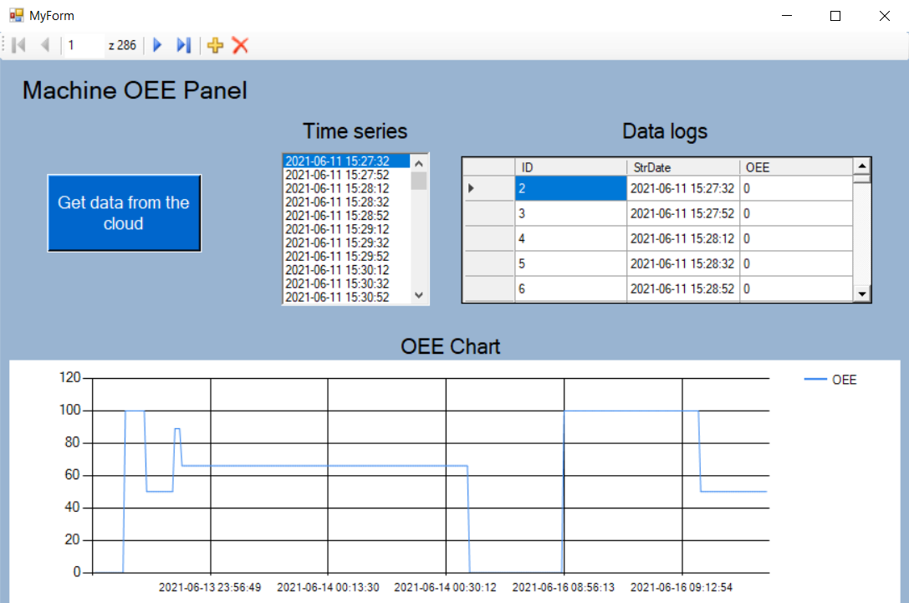

## Hardware and software requirements

- Siemens PLC S7-1200, S7-1500 or other programable controler. 
- Ewon Flexy (in my case it is 205) 
- Azure Account with some amount of cash. Some services are chargeable. 
- Visual Studio 2019
- Microsoft SQL Server Management Studio

## Links
Below you can find helpful links that I used to create and configure whole project. 

- [1] How to configure Remote Access and Communication with Ewon on TIA Portal 
[https://hmsnetworks.blob.core.windows.net/www/docs/librariesprovider10/downloads-monitored/manuals/application-user-guide/aug-0047-00-en-configure-remote-access-for-siemens-plc-through-tia-portal.pdf?sfvrsn=5ab549d7_23](https://hmsnetworks.blob.core.windows.net/www/docs/librariesprovider10/downloads-monitored/manuals/application-user-guide/aug-0047-00-en-configure-remote-access-for-siemens-plc-through-tia-portal.pdf?sfvrsn=5ab549d7_23).

- [2] Creating IO server with variables on Ewon for Siemens PLC with Ethernet protocol 
[https://hmsnetworks.blob.core.windows.net/www/docs/librariesprovider10/downloads-monitored/manuals/application-user-guide/aug-0048-00-poll-data-from-siemens-plc-using-ethernet-protocol.pdf?sfvrsn=17d757d7_9](https://hmsnetworks.blob.core.windows.net/www/docs/librariesprovider10/downloads-monitored/manuals/application-user-guide/aug-0048-00-poll-data-from-siemens-plc-using-ethernet-protocol.pdf?sfvrsn=17d757d7_9).

- [3] Basic Script Programming documentation on Ewon 
[https://developer.ewon.biz/system/files_force/rg-0006-01-en-basic-programming.pdf](https://developer.ewon.biz/system/files_force/rg-0006-01-en-basic-programming.pdf).

- [4] Thread on Ewon's forum about configuring eWON Flexy for Microsoft Azure with MQTT protocol
 [https://techforum.ewon.biz/thread-786.html](https://techforum.ewon.biz/thread-786.html).

- [5] Video on YT how to configure Ewon Flexy with Azure IOT Hub
[https://www.youtube.com/watch?v=YSZPyL_gxAg](https://www.youtube.com/watch?v=YSZPyL_gxAg).

- [6] Connecting IOT Hub with SQL Server on Azure Platform
[https://www.youtube.com/watch?v=9WQ2hGjFs6M](https://www.youtube.com/watch?v=9WQ2hGjFs6M).

- [7] Connecting Azure SQL Database with Microsoft SQL Server and Visual Studio 2019. 
[https://www.youtube.com/watch?v=JMcmJGogqyg](https://www.youtube.com/watch?v=JMcmJGogqyg).

## Configuration step-by-step

### 1. Tia Portal
In this section we need to enable connection with Ewon router from the PLC controller side. More detailed documentation is available on the developer's website [1].  

Set IP Adress of your PLC, it has to be in the same subnet as Ewon. In Tia go to: Device configuration → Profinet Interface → IP Protocol. Also you need to check "Use Router" and type Ewon adress in this field, like below.  

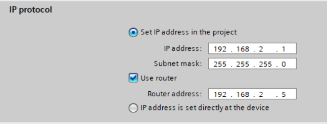

Then in Device configuration → Protection & Security check the tab to enable PUT/GET connection with Ewon. 

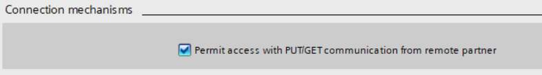

Last thing is to select your variable to send. It must have its own address. For testing purpose I created variable like below. 

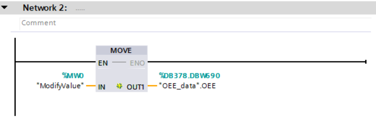

### 2. Ewon configuration

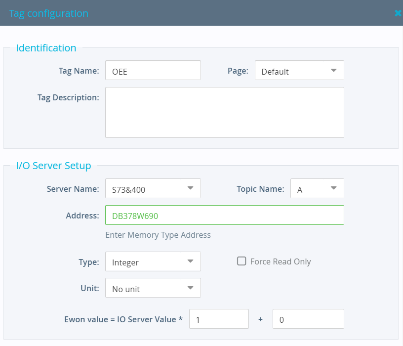

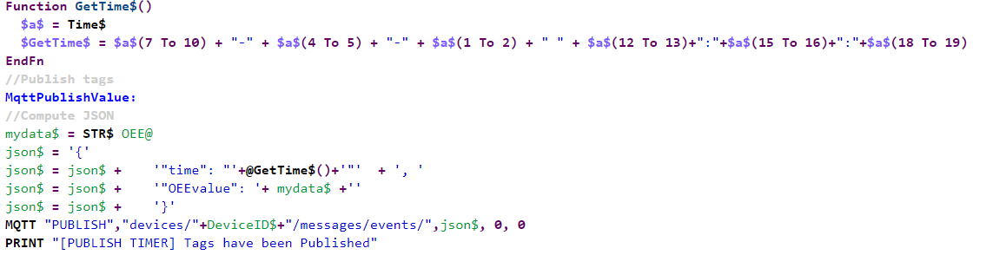

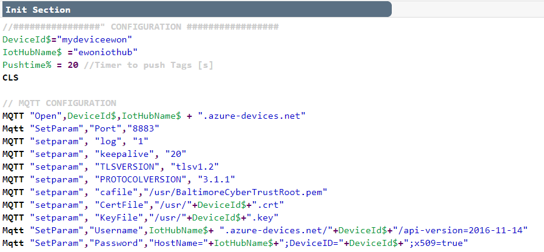

### 3. Azure Portal

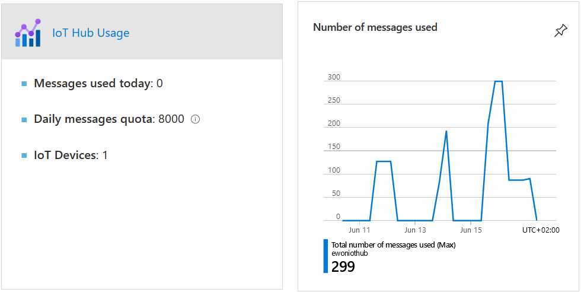

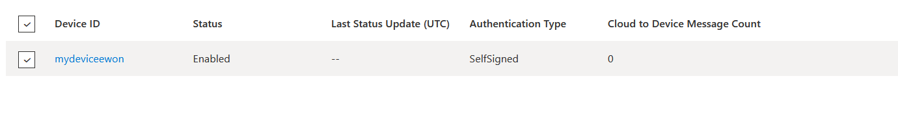

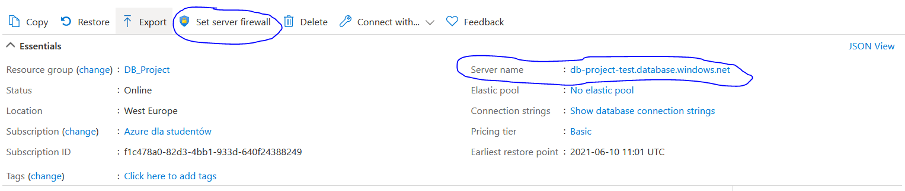

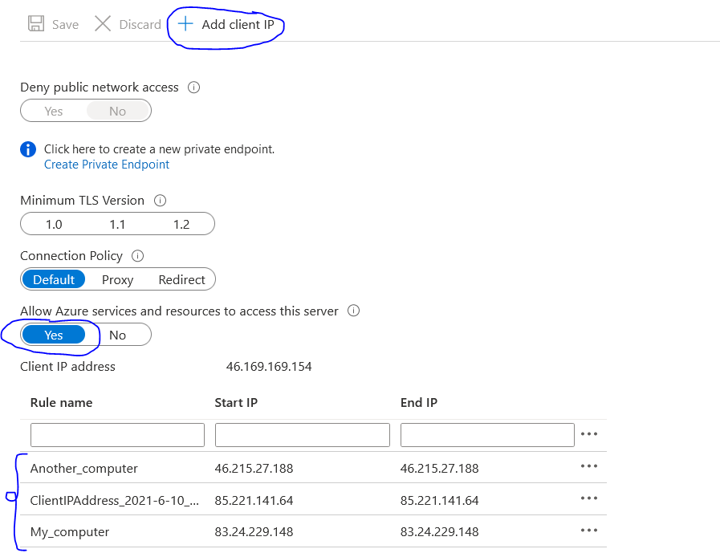

First you have to create table where you will save your data. To do it, firstly go to the step 4. and come back afterwards. 
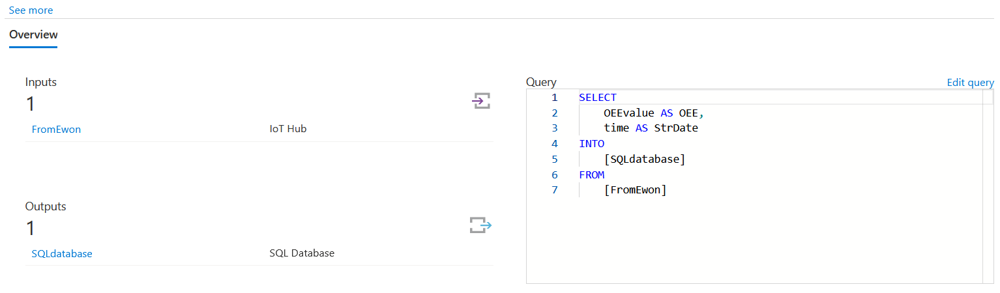

### 4. Microsoft SQL Server

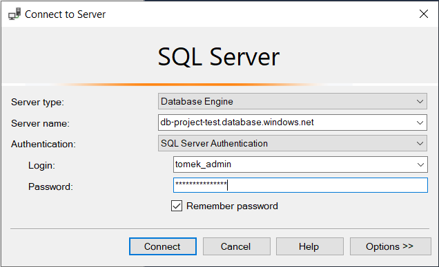

You can use [My SQL Script](/MyDBquery.sql) to create the basic table and check is it working.

### 5. Visual Studio

